<p align="center">
  
</p>

<p align="center">
  A 2D top-down, tile-based multiplayer safari zone for the browser.
</p>

<p align="center">
  <a href="https://poposafari.net"></a>
  <a href="https://github.com/poposafari/client/actions/workflows/build.yml"></a>
  = 18">
  = 8">
  <a href="LICENSE"></a>
  <a href="https://discord.gg/uqt7cqqT23"></a>
</p>

PopoSafari is a browser based Pokémon fangame built around the safari zone instead of the gym circuit. There are no badges to win and no champion to beat — you share a persistent, tile-based world with other trainers in real time, and everything you own you had to catch yourself. Roam dozens of safari zones under a clock that turns from dawn to night and weather that rolls in on its own, chase down the species that only show up in that exact combination, and turn what you catch into a party, a PC full of boxes, and a Pokédex that fills up one entry at a time.

The loop is simple and it never really ends: **explore → encounter → capture → collect**.

**No install**, **No download**. Create an account and you are in the safari zone.

## Screenshots

<p align="center">
  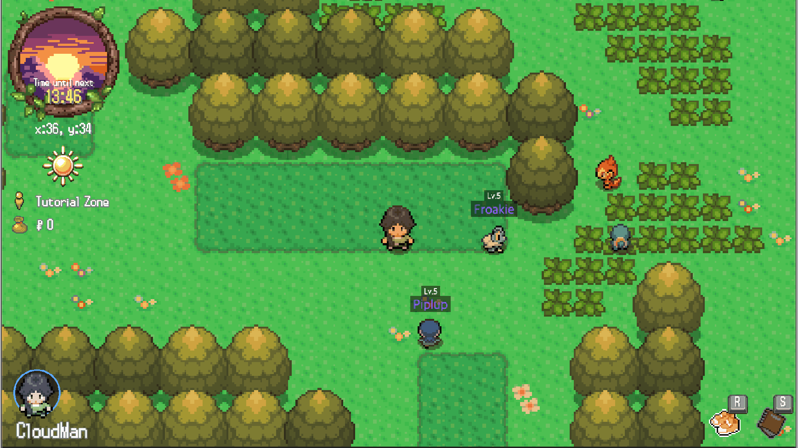
  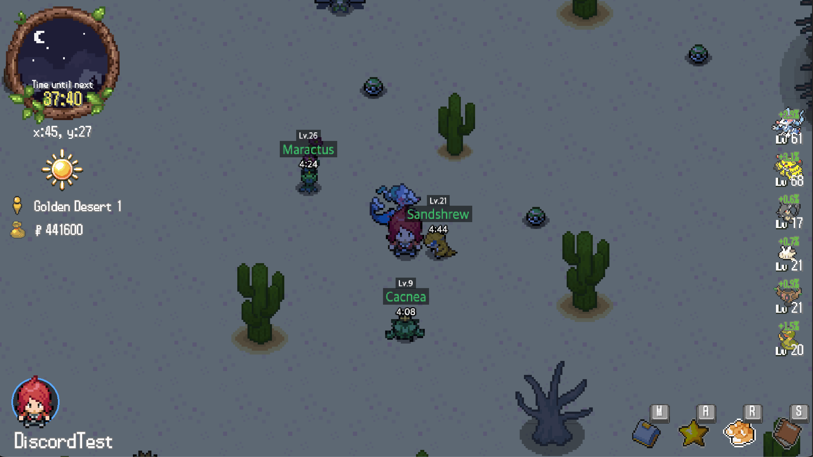
  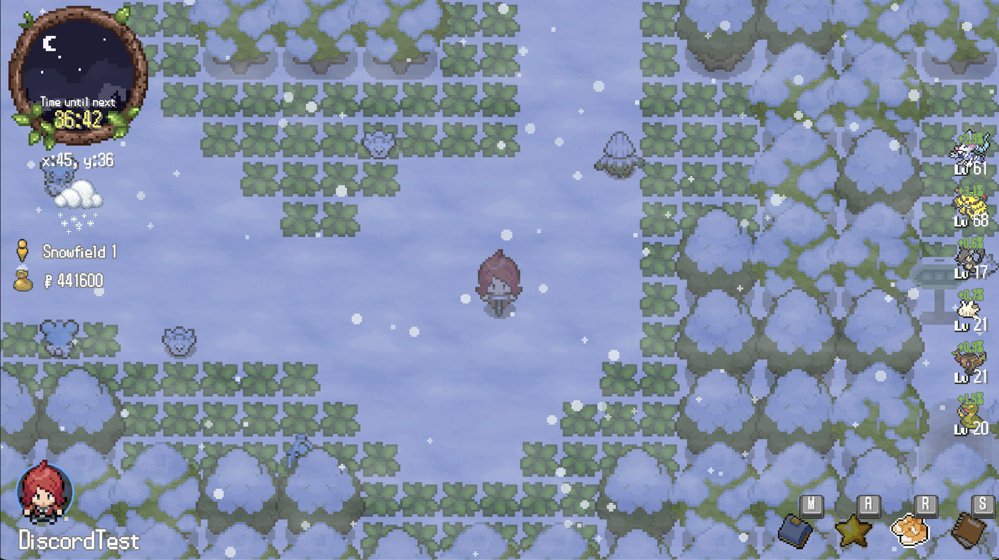
  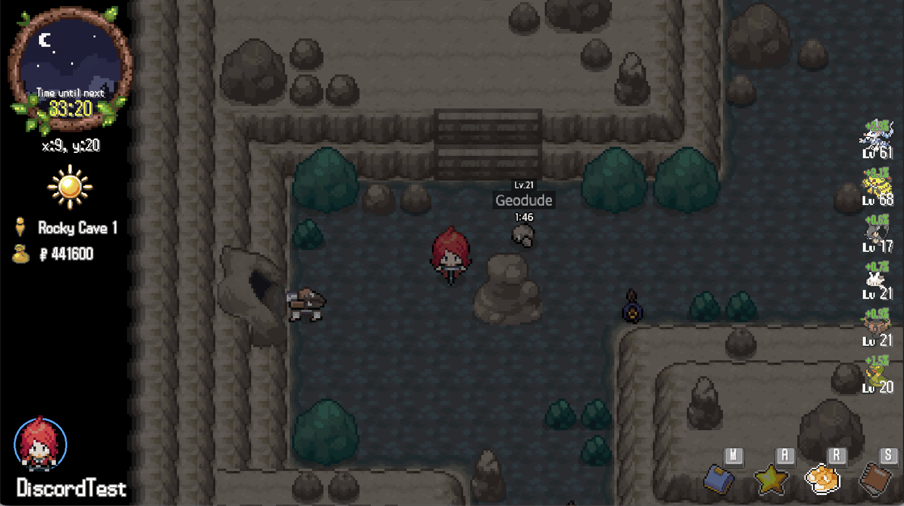
  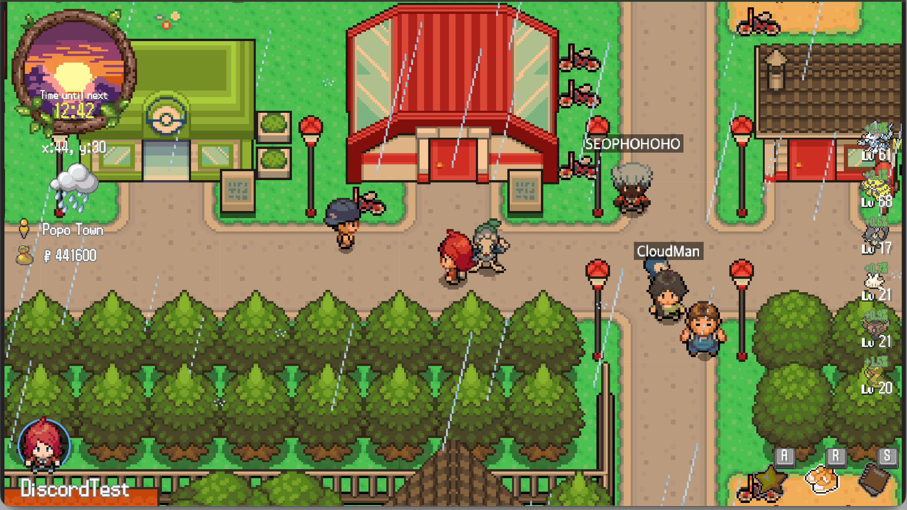
  <!-- <br> -->
  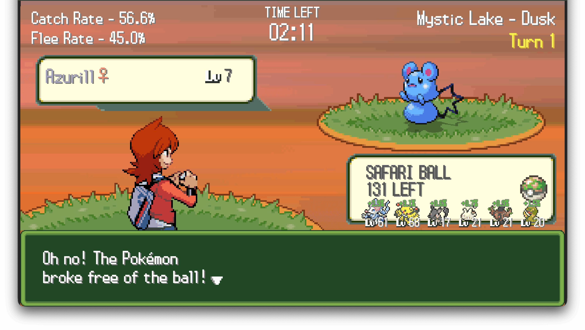
  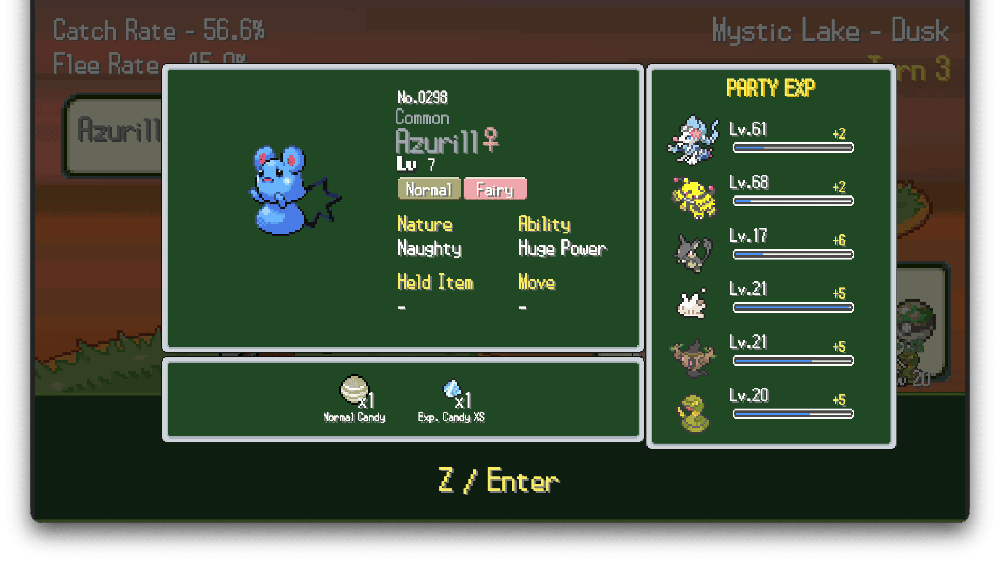
  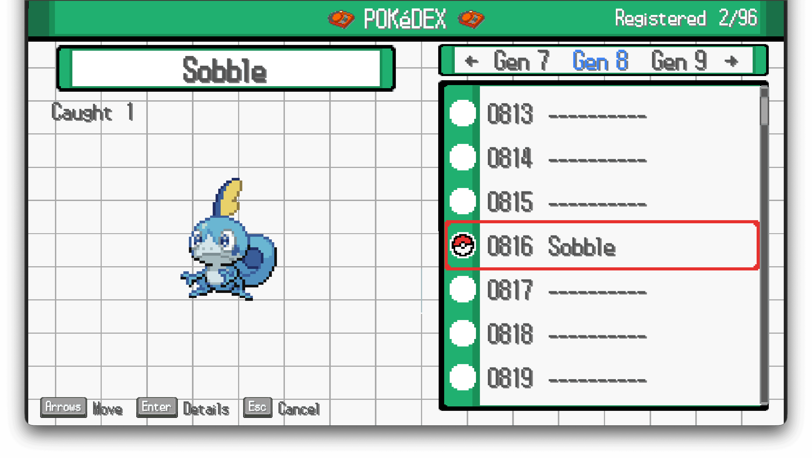
  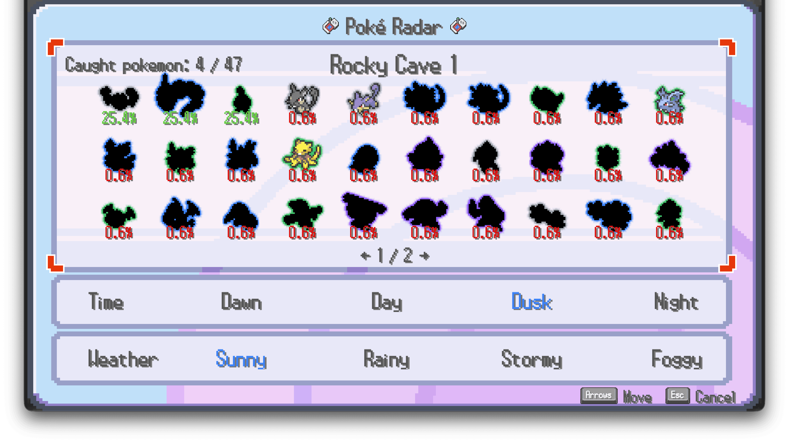
  <!-- <br> -->
  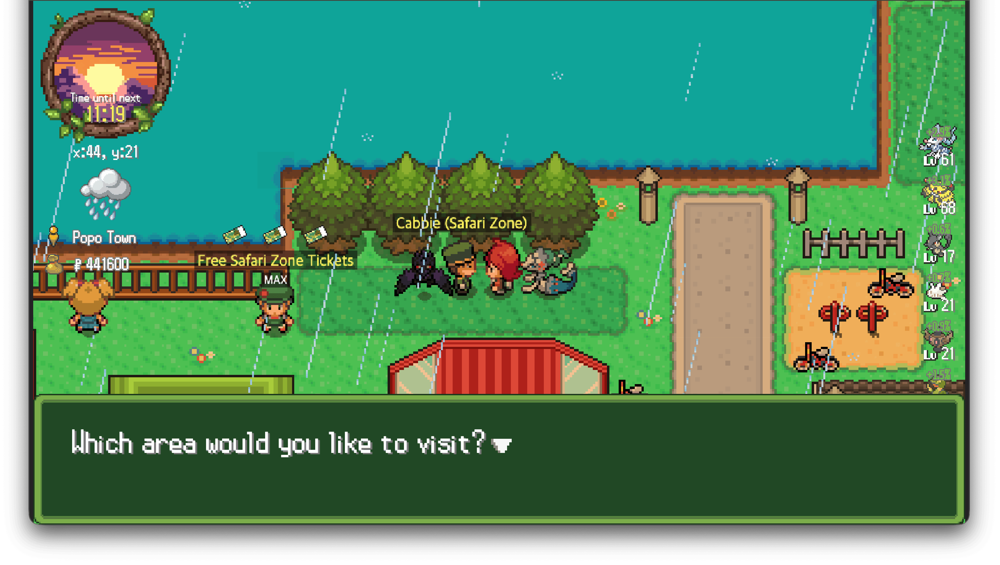
  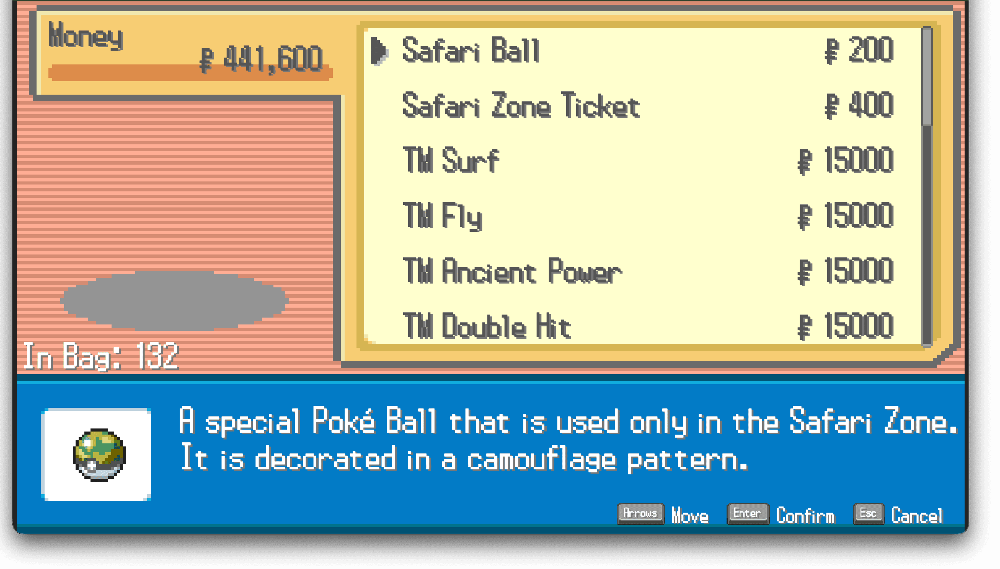
  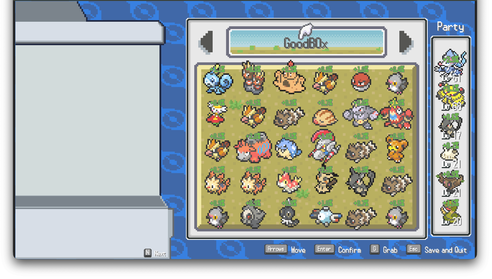
  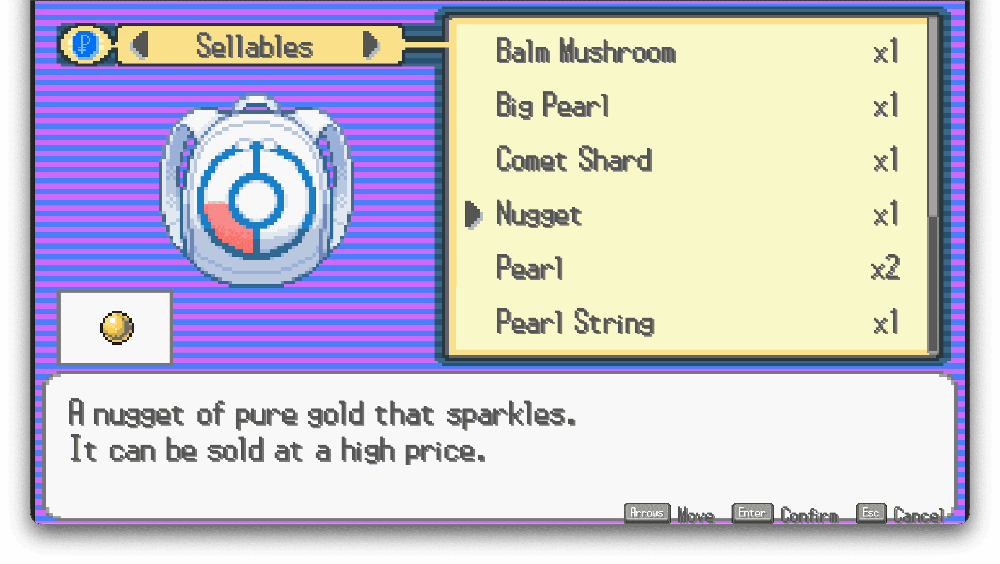
  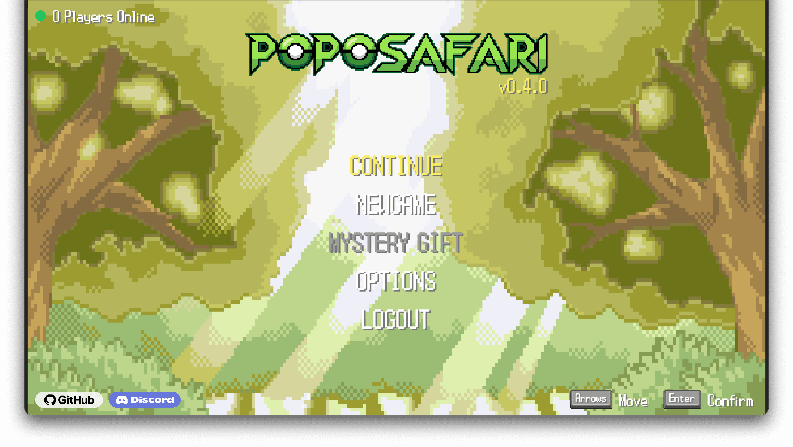
  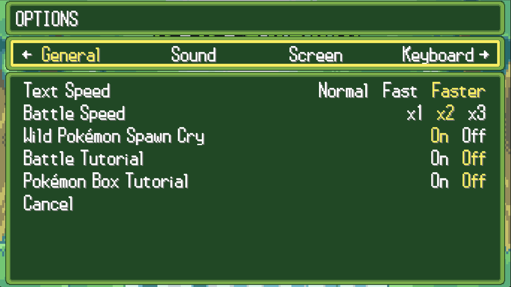
  <!-- <br> -->
</p>

## Features

> Unchecked items are planned but not yet implemented.

- [x] **A shared, persistent world** — walk a tile-based map alongside other players moving in real time (PopoTown and its buildings only — safari zones are private, so you won't see other players there). Your position, party, items, Pokémon boxes, and Pokédex are stored server-side and are still there tomorrow.
- [x] **A world that runs without you** — an in-game clock cycling through `dawn` / `day` / `dusk` / `night`, and a weather system that shifts on its own every few minutes. Wild Pokémon spawn and despawn on the server whether or not anyone is watching.
- [x] **Time × weather encounter tables** — every safari zone defines its own spawn table for each combination of time-of-day and weather. The same patch of grass gives you a different lineup at noon in the sun than at midnight in a storm.
- [x] **More maps** — a home town plus dozens of distinct safari zones today, each with its own tileset, encounter pool, and rarity spread, browsable from an in-game area map, with more zones on the way.
- [x] **Capture-focused gameplay** — no gym battles. Encounters are throws, not fights: pick your ball, weigh the odds, and live with the roll. Every capture chance is computed and validated by the server.
- [x] **Shinies and rarity tiers** — species are graded across eight rarity tiers, from `common` up through `uncommon`, `rare`, `super-rare`, `ultra-rare`, `epic`, `unique`, to `legendary`. Every wild encounter also has a 1/4096 chance of being shiny.
- [x] **Party, PC, and Pokédex** — a party of 6, PC boxes holding up to 1,500 Pokémon with **Grab** arrangement and nicknaming, and a Pokédex that tracks what you have caught, and where each pokemons appears.
- [x] **Progression** — six different EXP curves, every capture shares EXP across your whole party, evolution, Exp candies, and party composition that feeds back into your capture rate.
- [x] **Fossil revival** — 15 fossil recipes, from Helix and Dome all the way to the two-part Galar fossils that let you assemble Dracozolt, Arctozolt, Dracovish, and Arctovish.
- [x] **Economy** — buy and sell through the mart, hunt down treasure items worth selling, and manage a bag split into pockets for balls, berries, candy, TMs, and key items.
- [x] **TMs and hidden moves** — teach TMs to your Pokémon and use field moves to reach places the overworld otherwise walls off.
- [x] **Key items** — ride the bicycle to cross the map at speed, and expect the key item slot to keep growing.
- [x] **Soundtrack** — per-map music sourced from the mainline Pokémon games (see [CREDITS.md](CREDITS.md)), plus weather and footstep audio that reacts to what you are walking on.
- [x] **Gen 1–9 species** — catchable Pokémon span every generation released so far, Gen 1 through Gen 9.
- [x] **More languages** — English, Korean, Japanese, French, and Spanish today, all community-editable, with more on the way.
- [ ] **Mystery Gift** — redeem codes for one-off rewards.
- [ ] **Costumes** — dress your trainer with costumes rendered as layered sprites, so your look follows you into every map.
- [ ] **Legendary encounters** — a rare chance for a warp to open, leading to a location where a legendary Pokémon awaits.
- [ ] **Mainline safari zone mechanics** — new mechanics modeled after the safari zones from the Kanto, Johto, Hoenn, and Sinnoh games.

## Getting Started

### Prerequisites

- Node.js **>= 18**
- pnpm **>= 8**

### Run it

```bash
git clone https://github.com/poposafari/client.git
cd client
pnpm install
pnpm dev            # http://localhost:3000
```

### Do I need the server?

Partly. The app boots, loads assets, and reaches the title and login screens with no backend at all — enough to work on UI, sprites, animation, locale files, and anything before login.

Everything past login (the overworld, encounters, capture, bag, PC) needs a running backend, because the client holds no game state of its own. Point it at one by editing `.env.development`:

```bash
VITE_API_BASE_URL=http://localhost:9000/api
VITE_SOCKET_SERVER_URL=http://localhost:9000
```

<!-- TODO: if the server repo is public, link its setup instructions here. If it is not, say so plainly so contributors do not go looking. -->

## Project Structure

```
src/
├── main.ts          entry point — Phaser game config and bootstrap
├── scenes/          Phaser scenes (loading, game)
├── feats/           one folder per feature: overworld, safari, bag, pc,
│                    pokedex, battle, mart, login, option, tutorial, ...
├── containers/      reusable composite display objects
├── core/            managers and cross-cutting services — api, socket,
│                    input, audio, master data, user state, phase machine
├── locales/         en / ko / jp / fr / es translation files
├── assets/          asset manifests and loading keys
├── types/           shared type definitions
└── utils/           helpers
public/
├── master/          game master data (maps, Pokémon, items) as JSON
└── ui/              sprites, tilesets, UI atlases
```

Screens are driven by a **phase stack** in `core/phase.ts`: each phase pushes its UI, takes over input, and pops back to the previous one. If you are adding a screen, that is the seam to start from.

Path alias: `@poposafari/*` → `src/*`.

## Contributing

Contribution guidelines are still being worked out. Details coming soon.

## Translations

Translating is the easiest way to contribute and needs no backend.

Locale files live in `src/locales/<lang>/`. To fix or improve an existing language, edit the matching keys. To add a new one:

1. Copy `src/locales/en/` to `src/locales/<your-lang>/`.
2. Translate the values — leave the keys untouched.
3. Register the language in `src/i18n.ts`.
4. Run `pnpm dev` and check that nothing overflows its UI box. Text length varies a lot between languages, and the layouts are tight.

## Credits

Art, sound, and font sources are listed in [CREDITS.md](CREDITS.md). If you recognize uncredited work, please open an issue.

## License

Licensed under the [GNU Affero General Public License v3.0](LICENSE). If you deploy a modified version of this client — including as a network service — you must make your source changes available under the same license.

**Legal notice.** PopoSafari is a non-commercial fan project. Pokémon and all related names, characters, and assets are trademarks of Nintendo, Creatures Inc., and GAME FREAK Inc. This project is not affiliated with, endorsed by, or sponsored by any of them. No money is made from it, and no game assets are sold. Any license in this repository covers the source code written for this project, not the underlying intellectual property.
